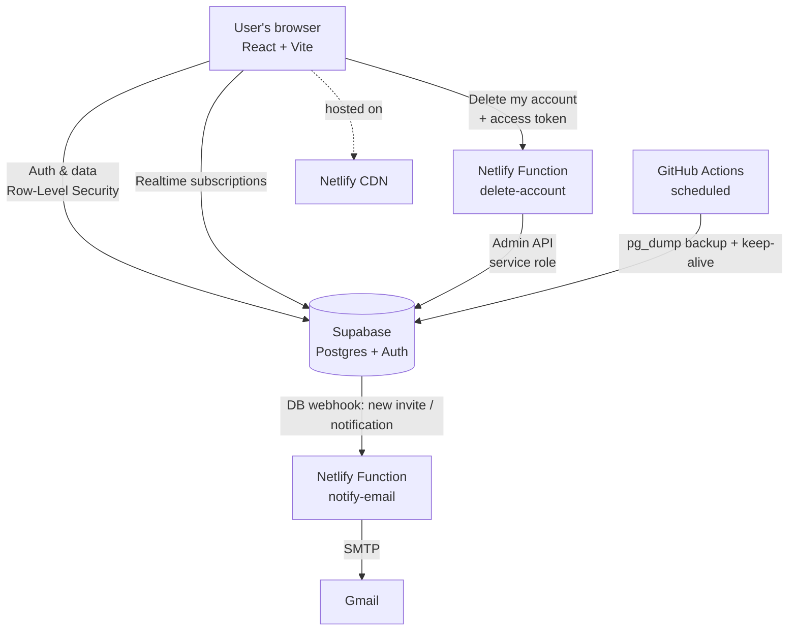

# Hope365 Workspace

A production project-management web app built for **Hope365 Network**, a faith-based NGO — used by real teams to organise projects, assign and track tasks, collaborate, and onboard members by email invitation.

**Live app:** https://hope365-workspace.netlify.app

> Built end to end: database design, security model, React frontend, serverless backend, authentication, transactional email, CI/CD, and production deployment.

---

## Why this project

Most portfolio apps are demos that never see a user. This one is different — it's **deployed and in active use** by an organisation. That framed every decision around reliability, security, and maintainability rather than just "getting it working." The goal was a tool a non-technical team could depend on daily, that a future maintainer could pick up, and that runs entirely on free-tier infrastructure.

---

## Key features

- **Role-based projects & tasks** — projects with admins and members; tasks with assignee, status, priority, start/due dates.
- **Four task views** — Kanban board (drag-and-drop), list, date timeline, and a charts dashboard.
- **Collaboration** — threaded comments and subtask checklists on every task.
- **Email invitation flow** — invite anyone by email; existing users are added instantly, new people receive a branded email, sign up, and are **auto-added to their project on registration**.
- **In-app + email notifications** — real-time bell notifications and transactional emails.
- **Self-service account deletion** — users can permanently delete their own account, with a safeguard preventing a project from being left without an admin.
- **Reporting dashboards** — per-project and org-wide charts (status breakdowns, progress, workload per person).
- **Fully responsive** — mobile-first layout with a slide-out navigation drawer.
- **Automated backups & uptime** — scheduled database backups and keep-alive via CI.

---

## Architecture



The frontend talks directly to Supabase for data, protected by **Row-Level Security** so authorization is enforced in the database itself, not just the UI. Side-effects that need elevated privileges or secrets — sending email, deleting an auth user — are isolated in **serverless functions** so no privileged key ever reaches the browser. Scheduled jobs run on **GitHub Actions**.

---

## Technical highlights

These were the interesting engineering problems, and what I'd point to in a code review:

**Database-enforced authorization (Row-Level Security).**
Rather than checking permissions in the frontend, access rules live in Postgres policies: a user can only read or write data for projects they belong to. Recursive-policy pitfalls (a policy that needs to query the same table it protects) are avoided with `SECURITY DEFINER` helper functions (`is_member`, `is_admin`, `shares_project`). This means the app is secure even if someone bypasses the UI and calls the API directly.

**Invite-and-claim onboarding flow.**
Inviting someone who has no account was the hardest feature. The solution: an `invitations` table records a pending invite; a database webhook fires a serverless function that emails a signup link; and a trigger on user creation (`handle_new_user`) **automatically claims any pending invitations matching the new user's email**, dropping them straight into their projects on first login — no manual step from the admin.

**Serverless email via database webhooks.**
Transactional emails are decoupled from the app entirely. A row inserted into `notifications` or `invitations` triggers a Supabase webhook → a Netlify function that looks up the recipient (with the service-role key, server-side only) and sends branded HTML email over SMTP. The app code doesn't know or care that email happens.

**Safe self-deletion.**
Account deletion is a serverless function that proves the caller's identity from their own access token (so it can *only* delete the requester's account), then refuses if they're the sole admin of any project — returning the blocking project names to the UI. Deletion cascades in the database remove personal data while **de-attributing** (not deleting) their tasks and comments, preserving the organisation's work history.

**Zero-cost production operations.**
Weekly `pg_dump` backups stored as CI artifacts, a keep-alive job to stop the free database auto-pausing, one-click rollback via the host, and a documented restore path — all on free tiers.

---

## Tech stack

| Area | Tools |
|---|---|
| Frontend | React, Vite, Recharts, hand-written CSS |
| Backend | Supabase (PostgreSQL, Auth, Row-Level Security, Realtime, Database Webhooks) |
| Serverless | Netlify Functions (Node/ESM), Nodemailer |
| Email | Gmail SMTP (transactional + branded auth templates) |
| CI/CD & Ops | GitHub Actions (scheduled backups + keep-alive), Netlify (CDN, auto-deploy, functions) |

---

## Running it locally

```bash
# 1. Install
npm install

# 2. Configure environment
cp .env.example .env
#    then fill in your Supabase project URL and publishable (anon) key

# 3. Run
npm run dev        # http://localhost:5173
```

> The email and account-deletion features run as serverless functions and only execute on a deployed environment, not the local dev server.

The database schema is defined in a set of ordered SQL files (see the `/sql` folder) that can be run in the Supabase SQL editor to stand up a fresh instance.

---

## Roadmap

- **AI weekly digest** — an LLM-generated summary of each project's activity and blockers, delivered on a schedule (templated fallback when the model is unavailable).
- Task-assignment email notifications.
- Calendar view and task dependencies (Gantt).

---

## About

Built and maintained by **Charity Umoren** — a medical doctor transitioning into AI/software engineering.
[LinkedIn](https://www.linkedin.com/in/charityumoren/) · [GitHub](https://github.com/) *(add your profile link)*

*This project demonstrates full-stack product engineering: designing a secure data model, building a real frontend, integrating third-party services, and running it reliably in production for actual users.*
